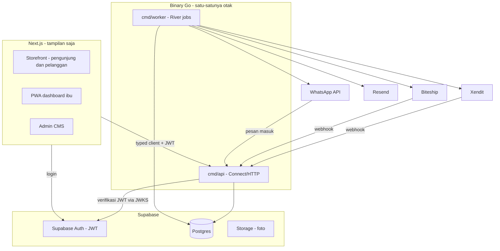
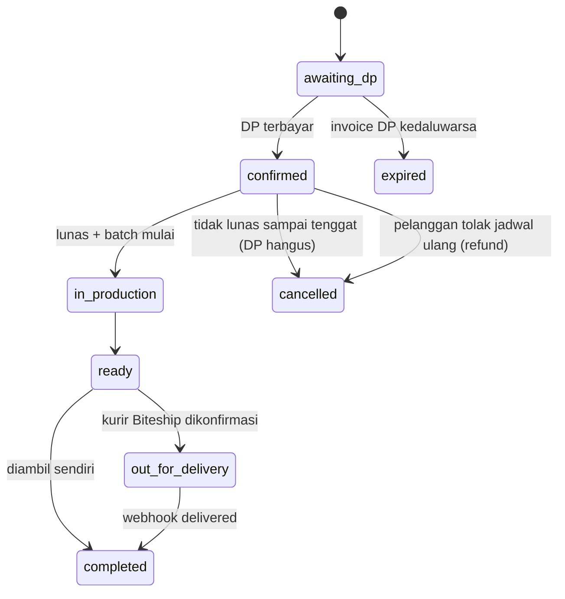
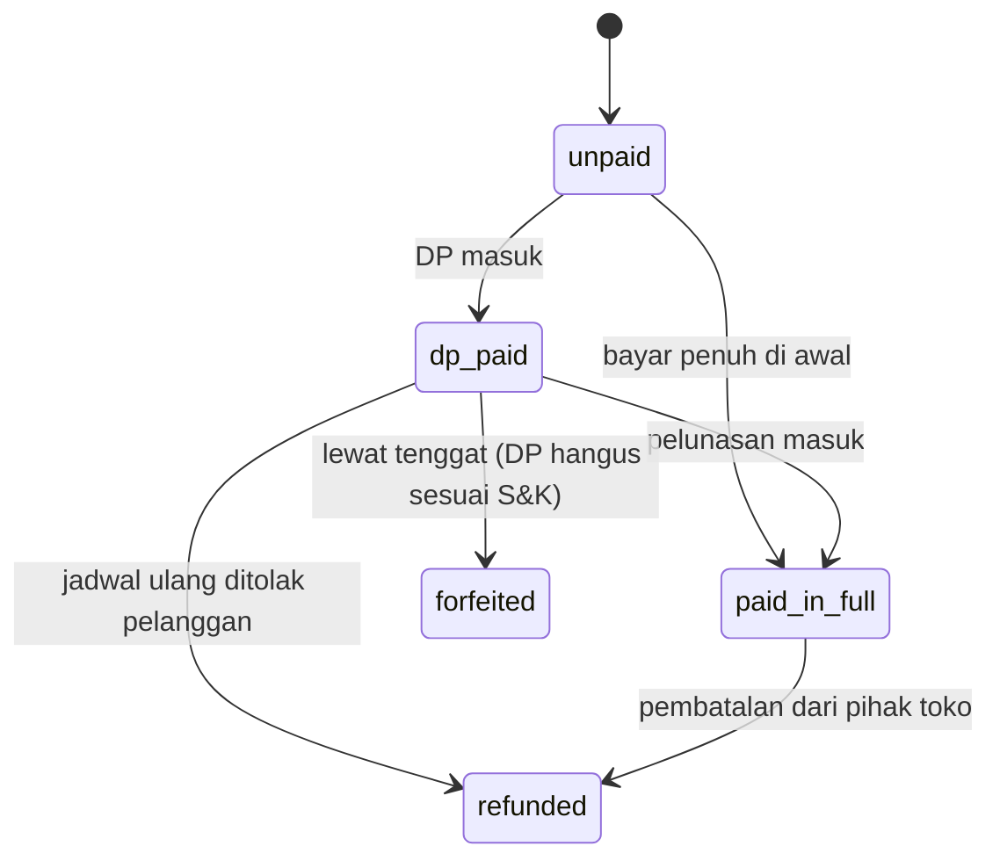
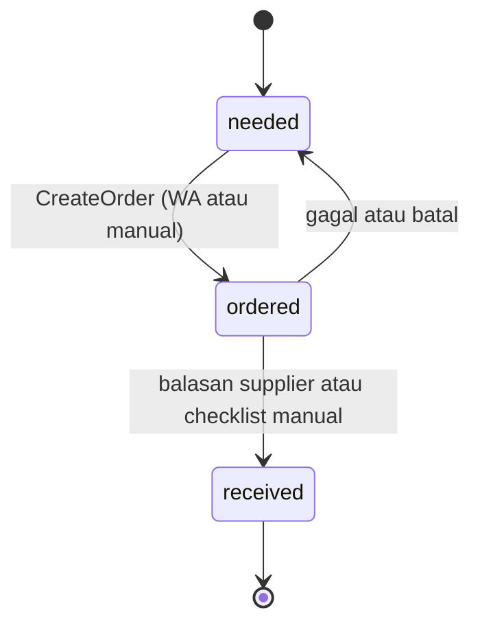

# Kue Preorder — Blueprint Arsitektur Go & System Design

Blueprint teknis untuk membangun platform preorder kue sebagai sistem **matang**:
benar, datanya utuh, teruji, observable, gagal dengan aman, dan mudah dirawat
bertahun-tahun. Bisa langsung dipakai sebagai konteks proyek di Claude Code.

> Prinsip pengarah: **matang ≠ rumit.** Ini bukan microservices, tapi *modular monolith*
> Go dengan batas domain yang tegas. Kematangannya ada di kualitas engineering, bukan di
> banyaknya komponen.

**Versi 2.** Keputusan teknis dan aturan bisnis sudah ditetapkan (lihat §27). Perubahan
utama dari v1: resep dua tingkat (varian → komponen → bahan), stok berbasis ledger dengan
penanganan bahan rusak, DP dengan SOP ketat, jadwal ulang massal dengan permintaan maaf ke
pelanggan, dan pengiriman lewat Biteship.

---

## 1. Definisi "matang" untuk proyek ini

| Pilar | Artinya di sini |
|---|---|
| **Benar** | Hitungan uang dan bahan tidak boleh salah. Uang disimpan sebagai integer, bukan float. Rumus punya invariant yang diuji. |
| **Integritas data** | Operasi kritis berjalan dalam satu transaksi. Webhook dan job **idempoten**, jadi tidak ada tagihan ganda atau order ganda. |
| **Batas domain jelas** | Modul saling bicara lewat interface (port), tidak mengakses tabel modul lain secara langsung. |
| **Teruji** | Engine (recipe + aggregation) coverage mendekati 100%. Integration test memakai Postgres sungguhan. |
| **Observable** | Log terstruktur, trace, dan error tracking. Kalau ada yang salah, langsung ketahuan di mana. |
| **Gagal dengan aman** | Retry berbatas, dead-letter, dan outbox. Kegagalan sebagian tidak merusak state. Kalau ragu, sistem memilih yang aman (misalnya tidak menghitung stok yang belum dicek). |
| **Aman** | Verifikasi JWT dan signature webhook, otorisasi di service, validasi input di batas sistem. |
| **Mudah dirawat** | Dependency stabil, migrasi forward-only, kontrak API bertipe, CI yang ketat. |

---

## 2. Prinsip arsitektur

1. **Modular monolith.** Satu binary `api` dan satu binary `worker`, dari satu codebase. Modul domain dipisah tegas dan berkomunikasi lewat interface, bukan lewat jaringan.
2. **Satu otak.** Semua logika bisnis ada di Go. Next.js hanya menampilkan halaman dan memanggil Go lewat client bertipe. Next.js **tidak pernah** mengakses database langsung.
3. **Aturan dependensi.** `recipe` adalah engine murni **tanpa dependensi** (tanpa DB, tanpa HTTP). Modul lain boleh bergantung ke `recipe`; `recipe` tidak bergantung ke modul mana pun. `platform` (lintas-modul) dipakai semua modul dan tidak bergantung ke modul domain.
4. **Ports & adapters.** Setiap integrasi luar (supplier, channel, payment, kurir) ada di balik interface. Implementasinya bisa diganti dan di-mock saat test.
5. **Correctness dulu.** Engine dibangun dan dibuktikan benar (M1) sebelum UI.
6. **Ledger, bukan angka yang ditimpa.** Stok dan pembayaran dicatat sebagai riwayat pergerakan (append-only). Saldo selalu dihitung dari riwayat, tidak pernah di-update langsung.
7. **Siap multi-tenant, tapi belum multi-tenant.** Kolom `tenant_id` sudah ada dan selalu dipakai untuk scoping sejak awal, dengan satu tenant default.

---

## 3. Tech stack

| Lapisan | Pilihan | Alasan |
|---|---|---|
| Bahasa | Go 1.26+ | Error eksplisit, tipe kuat, concurrency rapi, dependency stabil. Minimal 1.26 karena pgx v5.11 dan tool (golangci-lint, goose, buf) membutuhkannya |
| HTTP / RPC | **ConnectRPC + buf** (protobuf) | Kontrak bertipe dari ujung ke ujung, client TypeScript di-generate otomatis |
| Akses DB | **pgx** + **sqlc** | Query SQL bertipe, tanpa ORM |
| Migrasi | **goose** | Forward-only, versi jelas, tanpa auto-migrate |
| Job queue | **River** | Antrean job berbasis Postgres. Enqueue bisa ikut transaksi data |
| Rumus dari user | **expr-lang/expr** | Evaluator ekspresi yang bisa di-sandbox |
| Database, Auth, Storage | **Supabase** | Postgres + Auth (JWT) + Storage foto produk |
| Pembayaran | Xendit Go SDK | Invoice DP dan pelunasan, native Indonesia |
| Pengiriman | **Biteship API** | Ongkir multi-kurir, draft order, kurir instan, tracking |
| Email | Resend (REST) | Struk, tagihan, notifikasi |
| WhatsApp | Meta Cloud API atau BSP (Qiscus, Mekari Qontak) | Notifikasi pelanggan + adapter procurement |
| Log | `log/slog` (JSON) | Structured logging bawaan standard library |
| Trace / metric | OpenTelemetry | Span di job, webhook, dan agregasi |
| Error tracking | Sentry | Alert |
| Test infra | testcontainers-go | Postgres sungguhan di integration test |
| Lint | golangci-lint | Gerbang CI |
| Frontend | Next.js / React di monorepo yang sama | Memakai client TS hasil codegen |

---

## 4. Arsitektur tingkat tinggi



Alur utama: pelanggan bayar DP → webhook Xendit masuk ke `api` → order jadi `confirmed` dan event ditulis ke outbox dalam transaksi yang sama → `worker` menghitung ulang batch → daftar belanja di dashboard ibu ter-update → ibu belanja → pelunasan masuk → produksi → kurir Biteship dipanggil di hari pengambilan.

---

## 5. Struktur repo (monorepo)

```
/cmd
  /api                 # server Connect/HTTP
  /worker              # River worker
/internal
  /recipe              # ENGINE MURNI: model, fit, evaluate. TANPA db/http
  /aggregation         # batch → daftar belanja (bergantung ke recipe + port)
  /catalog             # produk, varian, komponen, bahan, supplier, resep
    domain.go  service.go  repo.go
    /postgres          # implementasi repo + kode sqlc
    /connect           # handler RPC
  /inventory           # lot stok, ledger pergerakan, cek stok, bahan rusak
  /orders              # lifecycle order, jadwal ulang
  /scheduling          # cutoff, slot pengambilan, hari libur, kapasitas
  /payments            # DP, pelunasan, refund, Xendit, ledger pembayaran
  /shipping            # Biteship: ongkir, draft order, konfirmasi, tracking
  /procurement         # port Adapter + manual + whatsapp
  /channels            # port Adapter + web + tokopedia
  /notifications       # template + kirim email/WA
  /identity            # verifikasi JWT, customers, resolusi tenant
  /platform            # db, jobs, outbox, idempotency, config, log, telemetry, clock
/api
  /proto               # file .proto (buf), sumber kontrak
  /gen/go /gen/ts      # hasil codegen
/db
  /migrations          # goose
  /queries             # file .sql untuk sqlc
/web                   # Next.js (memakai /api/gen/ts)
/deploy                # Dockerfile, config deploy
```

**Aturan dependensi:**
- `recipe` tidak mengimpor apa pun dari `internal/`. Lebih ketat lagi, `recipe` hanya boleh mengimpor standard library, `expr-lang/expr`, dan (di test) `pgregory.net/rapid`. (`depguard`, daftar izin)
- `aggregation` hanya mengimpor `recipe`, `platform`, dan paket akar modul lain (tempat interface service-nya). (`internal/archtest`)
- Modul tidak pernah mengimpor paket `postgres/` milik modul lain. `cmd/` boleh, karena di sanalah semua adapter dirakit. (`internal/archtest`)
- Waktu selalu lewat `platform/clock` (bukan `time.Now()`, `time.Since()`, atau `time.Until()` langsung), supaya cutoff dan tenggat bisa diuji. Zona bisnis selalu `clock.Jakarta`; `time.Local` dan `Time.Local()` dilarang, karena zona server bukan zona toko. Tanggal kalender WIB memakai `clock.Date`. (`forbidigo`)

`depguard` dan `forbidigo` berjalan di golangci-lint. Dua aturan lainnya tidak bisa dinyatakan secara umum di `depguard`, jadi `internal/archtest` memeriksanya dari graf import hasil `go list`, termasuk import di file test.

---

## 6. Modul domain dan tanggung jawabnya

| Modul | Tanggung jawab | Port yang diekspos |
|---|---|---|
| `identity` | Verifikasi JWT Supabase, data `customers`, resolusi `tenant_id` | `CustomerService`, `TenantResolver` |
| `catalog` | Produk, varian, komponen, bahan, supplier, resep non-linear | `Service` (CMS, dengan otorisasi), `Storefront` (toko publik: hanya yang dijual, tanpa login), `Reader` (baca in-process untuk checkout dan agregasi, per tenant, tanpa peran) |
| `recipe` | Hitung kebutuhan bahan per komponen dari model | `Model` (murni) |
| `inventory` | Lot stok, ledger, cek stok harian, pencatatan bahan dibuang | `InventoryService` |
| `orders` | Lifecycle order, jadwal ulang massal | `OrderService` |
| `scheduling` | Cutoff per produk, tanggal pengambilan yang sah, hari libur | `Service` (CMS: setelan dan tanggal libur), `Settings.Plan` (murni: jadwal satu order, dipakai checkout) |
| `aggregation` | Batch → daftar belanja (`batch_requirements`) | `BatchService` |
| `payments` | Kebijakan DP, invoice, pelunasan, refund, ledger | `PaymentService` |
| `shipping` | Ongkir, draft order, konfirmasi kurir, tracking | `ShippingService` |
| `procurement` | Kirim PO ke supplier, lacak status | `Adapter` (manual / whatsapp) |
| `channels` | Normalisasi order dari channel luar | `Adapter` (web / tokopedia) |
| `notifications` | Template dan pengiriman email/WA | `Notifier` |
| `platform` | db, jobs, outbox, idempotency, clock, config, log, telemetry (OpenTelemetry + Sentry) | — |

---

## 7. Kontrak API bertipe

Satu sumber kebenaran di `/api/proto` (buf). `buf generate` menghasilkan server Go **dan** client TypeScript. Kalau backend berubah dan frontend tidak cocok, frontend langsung gagal kompilasi.

CI menjalankan `buf lint` dan `buf breaking` untuk mendeteksi perubahan kontrak yang merusak client lama.

Tata letak:
- Paket proto per modul: `kuepreorder.<modul>.v1` di `api/proto/kuepreorder/<modul>/v1/`. Lint `STANDARD`, breaking `FILE`.
- `buf.gen.yaml` memakai managed mode untuk `go_package`. Plugin Go (`protoc-gen-go`, `protoc-gen-connect-go`) dijalankan lewat `go tool`, jadi versinya ikut `go.mod` dan selalu cocok dengan library runtime. Plugin TS (`buf.build/bufbuild/es`, protobuf-es v2) dikunci versinya di BSR; client memakai `@connectrpc/connect` v2.
- Hasil generate (`api/gen/go`, `api/gen/ts`) di-commit.

Service yang sudah ada: `kuepreorder.identity.v1.IdentityService` (`WhoAmI`), `kuepreorder.catalog.v1.CatalogAdminService` (CMS katalog dan resep, 26 RPC), `kuepreorder.catalog.v1.StorefrontService` (toko publik: `ListShopProducts`, `GetShopProduct`), dan `kuepreorder.scheduling.v1.ScheduleAdminService` (setelan jadwal dan tanggal libur). Tanggal ditulis `2006-01-02` dan jam `15:04`, keduanya waktu Asia/Jakarta. Semuanya dipasang di `cmd/api` dengan urutan interceptor yang sama: tracing → auth → handler, panic menjadi `Internal`, request maksimal 1 MiB.

**Konvensi kontrak** (berlaku untuk service berikutnya juga):
- Handler di `internal/<modul>/connect` hanya menerjemahkan proto ↔ domain. Aturan, normalisasi, dan otorisasi tetap di service.
- Error domain yang dipakai semua modul ada di `platform/apperr` (`ErrNotFound`, `ErrForbidden`, `ErrUnauthenticated`, `ValidationError`); modul mengekspornya ulang dengan namanya sendiri (`catalog.ErrNotFound`). Pemetaannya ke kode Connect ada di satu tempat, `platform/rpcerr`, termasuk parsing ID (`rpcerr.IDs`).
- ID berupa string UUID. ID kosong diteruskan sebagai `uuid.Nil` agar service menjawab dengan pesannya sendiri ("Pilih produknya."). ID yang bukan UUID langsung `InvalidArgument` untuk field itu, sebelum otorisasi. Yang bocor hanya fakta bahwa string itu bukan UUID, tidak ada data yang ikut bocor.
- RPC baca ditandai `NO_SIDE_EFFECTS`, jadi client boleh memanggilnya lewat HTTP GET (`useHttpGet` di connect-web) dan hasilnya bisa di-cache. Storefront memakainya.
- Pesan untuk pelanggan terpisah dari pesan CMS (`ShopProduct` dan `ShopVariant` vs `Product` dan `Variant`), supaya field internal seperti SKU, menit produksi, dan resep tidak pernah ikut keluar ke publik hanya karena ditambahkan ke CMS.
- Uang `int64` rupiah, yang di TypeScript menjadi `bigint`. Nilai enum `UNSPECIFIED` berarti "pakai default" kalau default-nya ada (aturan sisa, cara pesan), dan kalau tidak ada, ditolak seperti input kosong.
- Parameter resep dikirim sebagai string JSON (`params_json`). Isinya dijamin JSON, formatnya tidak (jsonb Postgres menata ulang spasi).
- **Error:**

  | Error domain | Kode Connect | Detail |
  |---|---|---|
  | `ValidationError` | `InvalidArgument` | `kuepreorder.validation.v1.FieldErrors`: nama field request (snake_case) → pesan bahasa Indonesia |
  | `ValidationError` dengan `Conflict` (slug/SKU/nama sudah dipakai) | `AlreadyExists` | `FieldErrors` |
  | `ErrNotFound` (termasuk record tenant lain) | `NotFound` | — |
  | `ErrForbidden` | `PermissionDenied` | — |
  | `identity.ErrUnauthenticated` | `Unauthenticated` | — |
  | lainnya | `Internal` | Pesan generik; detailnya hanya di log ERROR (dan Sentry) |

  Form di `web/` membaca detail lewat `ConnectError.findDetails(FieldErrorsSchema)` dan menandai setiap field yang disebut.

---

## 8. Auth (Supabase)

1. Pelanggan atau admin login di Next.js memakai `supabase-js`. Supabase Auth memberi JWT.
2. Next.js mengirim JWT di header setiap panggilan ke Go.
3. Go memverifikasi JWT memakai JWKS Supabase (di-cache, dirotasi otomatis), lalu memetakan `sub` ke `customers.auth_user_id`.
4. Peran (pelanggan / admin / ibu) disimpan di tabel `staff_roles` milik aplikasi, bukan di klaim JWT, supaya bisa dicabut seketika.
5. **Pelanggan masuk dengan OTP WhatsApp, tanpa password** (diputuskan 2026-09-26). Supabase Auth memakai login nomor HP; kodenya dikirim `api` lewat WhatsApp melalui **Send SMS Hook** Supabase (tersedia di paket Free dan Pro; dibangun di M2.5). Tidak ada checkout tanpa nomor terverifikasi, jadi satu nomor adalah satu orang dan notifikasi tidak salah alamat. Pelanggan melihat pesanannya setelah masuk; tidak ada lagi `guest_access_token`. Melihat katalog dan meminta penawaran (`QuoteOrder`) tetap tanpa login. Setiap OTP berbayar, jadi permintaan OTP dibatasi per nomor dan per IP, dan diberi Turnstile setelah Cloudflare terpasang (§22).

**Verifikasi token** (`internal/identity`):
- Kunci publik diambil dari `<SUPABASE_URL>/auth/v1/.well-known/jwks.json`, di-refresh tiap jam. Token dengan `kid` baru (rotasi key) memicu refresh paling sering sekali per menit; refresh itu diberi waktu hingga 5 detik, dan `kid` tak dikenal berikutnya di menit yang sama langsung ditolak alih-alih menunggu slot berikutnya. Gagal mengambil JWKS saat start tidak menghentikan `api`; token ditolak sampai key berhasil dimuat, dan kegagalannya di-log.
- Hanya algoritma **ES256/RS256** yang diterima. HS256 (secret lama) dan `none` ditolak, sehingga token tidak bisa memilih algoritma yang lebih lemah.
- Klaim yang diperiksa: `iss` = `<SUPABASE_URL>/auth/v1`, `aud` = `authenticated`, `exp` wajib, `iat` tidak di masa depan, toleransi selisih jam 30 detik, waktu dari `platform/clock`. `role` harus `authenticated`, bukan anonymous sign-in, dan `sub` harus UUID.

**Autentikasi vs otorisasi:**
- Interceptor Connect hanya **mengautentikasi**. Tanpa header `Authorization`, request lanjut sebagai anonim. Header yang ada tapi tidak valid langsung `Unauthenticated`, supaya client dengan sesi rusak tidak diam-diam menjadi anonim. Token tidak pernah di-log.
- Service tiap modul **mengotorisasi** lewat `identity.Service.Principal(ctx)` (user, tenant, peran, `customer_id`).
- Mode single-tenant: `api` menolak start kalau jumlah tenant bukan tepat satu.

**Siapa boleh apa** (ditegakkan di service tiap modul; diputuskan 2026-09-25):

| Aksi | `owner` | `kitchen` (ibu) | pelanggan / anonim |
|---|---|---|---|
| Produk, varian, **harga**, supplier, kemasan | ✅ | ❌ (hanya lihat) | ❌ |
| Komponen, bahan, dan resep (termasuk titik ukur) | ✅ | ✅ | ❌ |
| Melihat seluruh katalog di CMS | ✅ | ✅ | ❌ |
| Melihat yang dijual di storefront | ✅ | ✅ | ✅ |
| Setelan jadwal (buffer belanja, jam ambil, kapasitas) | ✅ | ❌ (hanya lihat) | ❌ |
| Tanggal libur | ✅ | ✅ | ❌ |
| Penawaran order: harga, DP, dan jadwal (`QuoteOrder`) | ✅ | ✅ | ✅ |

Tanpa login hasilnya `Unauthenticated`; login tanpa peran yang cocok hasilnya `PermissionDenied`. Storefront publik tidak memeriksa peran dan hanya menampilkan yang dijual: produk aktif yang punya minimal satu varian aktif, beserta varian aktifnya saja (termurah dulu). Tenant diambil dari `TenantResolver`, bukan dari orangnya. Slug dicocokkan tanpa membedakan huruf besar-kecil. Token yang ada tapi rusak tetap `Unauthenticated`.
- Peran `owner` pertama diberikan manual lewat SQL (lihat README). Setelah itu owner mengelola staf lewat CMS (M5).

**Setelan project Supabase:** Data API dimatikan (lihat §9), signing key aktif ECC P-256 (ES256). Menjelang go-live: pindah ke API key baru (`sb_publishable_…` untuk browser, `sb_secret_…` untuk server), lalu revoke secret HS256 lama. Kunci anon/service_role lama ikut mati saat itu.

---

## 9. Model data

Semua tabel milik tenant punya `tenant_id uuid not null` dan **selalu** di-scope di repository. Uang disimpan sebagai `bigint` **rupiah**. Berat bahan dalam gram (atau ml/pcs sesuai `base_unit`).

### 9.1 Integritas lintas sistem

```sql
webhook_events ( id, provider text, event_id text,
                 received_at timestamptz, processed_at timestamptz null,
                 unique (provider, event_id) )
outbox ( id, tenant_id, aggregate text, event_type text, payload jsonb,
         created_at timestamptz, published_at timestamptz null )
tenants ( id, name, created_at )
staff_roles ( id, tenant_id, auth_user_id uuid, role text )   -- 'owner' | 'kitchen'
audit_log ( id, tenant_id, actor_id uuid, action text, entity text, entity_id uuid,
            before jsonb, after jsonb, reason text not null, created_at timestamptz )
            -- append-only: trigger menolak UPDATE dan DELETE
```

### 9.2 Identitas

```sql
customers ( id, tenant_id, auth_user_id uuid null, name, email, phone,
            unique (tenant_id, id) )
customer_addresses ( id, tenant_id, customer_id, label, address text,     -- M6, untuk delivery
                     postal_code text, lat numeric, lng numeric, notes text )
```

Nomor HP pelanggan selalu terverifikasi lewat OTP (§8): satu baris per akun per tenant. Email opsional dan hanya dipakai untuk arsip.

### 9.3 Katalog: produk → varian → komponen → bahan

Resep dua tingkat. **Varian** adalah barang yang dibeli pelanggan. **Komponen** adalah
setengah jadi yang dibuat dalam satu adonan dan bisa dipakai bersama oleh banyak varian.
Rumus non-linear menempel di **komponen**, karena yang dibuat bersamaan adalah adonannya.

```sql
products ( id, tenant_id, name, slug, description, image_path, is_active )

product_variants (
  id, tenant_id, product_id, sku text,   -- unik per tenant
  name text,                         -- "Donut Coklat", "Lapis Legit 20x20"
  options jsonb,                     -- {"rasa":"coklat"} / {"ukuran":"20x20"}
  price_idr bigint,
  production_minutes int check (production_minutes between 1 and 240),
  min_notice_hours int,              -- jarak minimal pesan → ambil (termasuk waktu belanja)
  is_active bool
)

components (                         -- adonan / isian / topping / kemasan
  id, tenant_id, name,               -- "Adonan donut", "Topping coklat", "Adonan lapis legit"
  unit_label text                    -- "porsi", "loyang", "pcs"
)

variant_components (                 -- linear per unit varian
  id, tenant_id, variant_id, component_id,
  units_per_item numeric,            -- 1 donut coklat = 1 porsi adonan donut + 1 porsi topping coklat
  unique (variant_id, component_id)  -- lapis 20x20 = 2 loyang-unit adonan lapis (atau komponen sendiri)
)

component_ingredients (              -- TEMPAT RUMUS NON-LINEAR
  id, tenant_id, component_id, ingredient_id,
  model_type text,                   -- 'affine' | 'power' | 'piecewise' | 'formula'
  params jsonb, measured_points jsonb default '[]',
  waste_factor numeric default 1.0,
  version int default 1,
  unique (component_id, ingredient_id)
)

ingredients (
  id, tenant_id, name, base_unit text,          -- 'g' | 'ml' | 'pcs'
  is_perishable bool,                           -- butter, keju, susu, telur: true
  shelf_life_days int null,                     -- umur simpan setelah diterima
  leftover_policy text default 'auto'           -- 'auto' | 'confirm' | 'never'
)
suppliers ( id, tenant_id, name, whatsapp_phone, adapter_key text default 'manual' )
ingredient_suppliers ( id, tenant_id, ingredient_id, supplier_id, supplier_sku,
                       pack_size numeric, pack_unit text,
                       price_idr bigint null, is_default bool )
```

Aturan skema (migrasi `00003_catalog.sql`):
- **Unik per tenant, bukan global:** `sku` varian, `slug` produk, serta nama komponen, bahan, dan supplier (tanpa membedakan huruf besar/kecil). Toko lain boleh memakai kode yang sama.
- **Resep tidak bisa menyeberang tenant:** tabel induk punya `unique (tenant_id, id)` dan tabel anak memakai foreign key komposit `(tenant_id, …_id)`. Database menolak varian toko A yang memakai komponen toko B, bahan atau supplier tenant lain, dan seterusnya.
- **Constraint:** `production_minutes` 1..240, `min_notice_hours` >= 0, `price_idr` >= 0, `units_per_item` > 0, `waste_factor` >= 1 (sama dengan `recipe.Quantity`), `model_type` salah satu dari empat model, `params` objek JSON, `measured_points` array JSON, `options` objek JSON, `slug` kebab-case, `base_unit` `g`/`ml`/`pcs`, `whatsapp_phone` format E.164 dan wajib untuk supplier `whatsapp`, `pack_size` > 0. Isi `params` divalidasi `recipe.Build` + `recipe.Validate` di service katalog.
- **Bahan mudah rusak tidak boleh `leftover_policy = auto`** (§12: kalau ragu, jangan dihitung). `is_perishable` dan `leftover_policy` tidak bisa saling bertentangan.
- **`pack_size` dalam satuan dasar bahan** (1000 untuk sak tepung 1 kg dalam gram, 10 untuk tray telur), jadi pembulatan ke kemasan tidak pernah mencampur satuan. `pack_unit` hanya label tampilan ("sak 1 kg", "tray"). `price_idr` di `ingredient_suppliers` adalah harga per kemasan.
- **Paling banyak satu kemasan default per bahan** (indeks unik parsial `where is_default`): itulah kemasan yang dipakai pembulatan daftar belanja.
- Setiap tabel katalog punya `created_at` dan `updated_at`.
- Storefront (`ShopCatalog`, `ShopProduct`) membaca produk dan variannya dengan satu `join`, jadi keduanya berasal dari snapshot yang sama. Tidak mungkin tampil produk yang variannya baru saja dimatikan di antara dua query.
- Query baca untuk agregasi (`ComponentsOfVariants`, `IngredientsOfComponents`, `DefaultPacks`) selalu di-scope `tenant_id` dan berurutan deterministik. Varian yang dinonaktifkan tetap ikut, karena order yang masuk sebelumnya tetap harus diproduksi.

Aturan menyimpan resep (M1.5):
- **Baris resep hanya tersimpan setelah lolos `recipe.Build` + `recipe.Validate`.** Bisa diisi dari model langsung (`model_type` + `params`) atau dari titik ukur (`model_type` + titik; di-fit oleh engine, titik mentah ikut tersimpan di `measured_points`). Titik ukur paling banyak 100, termasuk yang disimpan hanya sebagai referensi di samping `params`. `params` disimpan dalam bentuk kanonik `recipe.Params`.
- **`version` naik hanya pada perubahan nyata.** Perbandingan memakai `jsonb` dan `numeric`, jadi menyimpan resep yang sama dengan penulisan berbeda (urutan kunci, `100` vs `100.0`) tidak dihitung perubahan.
- **Komposisi varian diganti utuh dalam satu transaksi** (`SetVariantComponents`); kalau satu komponen gagal, semua batal, termasuk penghapusan.
- **Setiap perubahan resep menulis event `catalog.recipe_changed` ke `outbox` di transaksi yang sama**: aggregate `variant` untuk komposisi varian, `component` untuk baris resep (termasuk penghapusan). Simpan ulang tanpa perubahan tidak menulis event. Penulisan resep mengunci baris varian atau komponennya, jadi dua edit resep yang sama berjalan bergantian.
- `catalog.Reader` merakit baris resep menjadi `recipe.Model` lengkap dengan `waste_factor` dan aturan pembulatan satuannya. Baris yang tidak bisa dirakit menghasilkan `ErrBrokenRecipe` yang menyebut komponen dan bahannya (§11: sistem tidak menebak).

### 9.4 Stok (ledger)

```sql
stock_lots (
  id, tenant_id, ingredient_id,
  received_at timestamptz, expires_at timestamptz null,
  source_procurement_item_id uuid null,
  status text                        -- 'available' | 'needs_check' | 'exhausted' | 'discarded'
)
stock_movements (                    -- APPEND-ONLY. Saldo = SUM(qty)
  id, tenant_id, lot_id, ingredient_id,
  kind text,                         -- 'receive' | 'consume' | 'waste' | 'adjust'
  qty numeric,                       -- positif masuk, negatif keluar
  batch_id uuid null, reason text null,   -- mis. 'bau', 'berjamur', 'kedaluwarsa', 'opname'
  actor_id uuid, created_at timestamptz
)
stock_checks (                       -- hasil "cek stok" oleh ibu
  id, tenant_id, lot_id, result text,     -- 'ok' | 'discard'
  checked_by uuid, checked_at timestamptz, note text
)
```

### 9.5 Jadwal

```sql
schedule_settings ( tenant_id primary key,
                    shopping_buffer_hours int,     -- 0..168; waktu belanja sebelum produksi
                    daily_capacity_minutes int null,   -- 1..1440; null = tidak dibatasi
                    pickup_window_start time, pickup_window_end time,   -- jam dinding WIB, start < end
                    updated_at timestamptz )
closed_dates ( id, tenant_id, date date, reason text, created_at,   -- ibu libur / hari raya
               unique (tenant_id, date) )
```

Tenant tanpa baris `schedule_settings` memakai `scheduling.DefaultSettings()`. Default hanya ada di Go, tidak di SQL. Perubahan pertama di CMS menyisipkan barisnya (upsert).

### 9.6 Order dan jadwal ulang

```sql
channels ( id, tenant_id, key text, name, is_active bool )

orders (
  id, tenant_id, customer_id, channel_id, external_order_ref text null,
  status text,                        -- lihat §13
  payment_status text,                -- lihat §14
  fulfillment_type text,              -- 'pickup' | 'delivery' (delivery dan address_id di M6)
  -- jadwal dikunci saat checkout (scheduling.Plan, §15)
  pickup_at, production_start_at, production_date date,   -- production_date: kunci batch (WIB)
  shopping_cutoff_at,                 -- cutoff milik order ini; cutoff batch = yang paling awal
  dp_due_at, balance_due_at,
  -- uang dikunci saat checkout (§14); pajak 0 sampai kebijakan pajak ditetapkan (§27)
  subtotal_idr, tax_idr, shipping_idr bigint,
  total_idr bigint,                   -- check: subtotal + tax + shipping
  dp_required_idr bigint,             -- check: 1..total; = total kalau wajib lunas
  full_payment_required bool,
  terms_version text, terms_accepted_at timestamptz,
  idempotency_key uuid,               -- unique per pelanggan: checkout ganda = satu order
  unique (channel_id, external_order_ref)
)
order_items ( id, tenant_id, order_id, variant_id,
              product_name, variant_name,            -- disalin saat checkout
              quantity int check (1..1000), unit_price_idr bigint,
              production_minutes, min_notice_hours,  -- disalin saat checkout
              unique (order_id, variant_id) )

reschedule_requests (                 -- satu aksi massal oleh admin
  id, tenant_id, reason_code text, reason_text text,
  shift_days int null, new_pickup_at timestamptz null,
  created_by uuid, created_at timestamptz
)
order_reschedules (
  id, tenant_id, request_id, order_id,
  old_pickup_at timestamptz, new_pickup_at timestamptz,
  customer_response text,             -- 'pending' | 'accepted' | 'declined' | 'auto_accepted'
  responded_at timestamptz null,
  unique (request_id, order_id)
)
```

### 9.7 Produksi dan procurement

```sql
production_batches ( id, tenant_id, batch_date date,
                     status text default 'open',   -- 'open' | 'locked' | 'in_production' | 'done'
                     computed_at timestamptz null, error text null,
                     unique (tenant_id, batch_date) )
batch_component_totals ( id, tenant_id, batch_id, component_id, units numeric,
                         unique (batch_id, component_id) )     -- jejak audit: U_c per batch
batch_requirements ( id, tenant_id, batch_id, ingredient_id,
                     qty_needed bigint, qty_usable_stock numeric, qty_to_buy numeric,
                     supplier_id null, status text default 'needed',
                     unique (batch_id, ingredient_id) )
procurement_orders ( id, tenant_id, batch_id, supplier_id, adapter_key text,
                     external_ref text null, status text default 'draft',
                     sent_at timestamptz null )
procurement_order_items ( id, tenant_id, procurement_order_id, ingredient_id,
                          qty numeric, pack_unit text )
```

### 9.8 Pembayaran (ledger)

```sql
payment_policies ( tenant_id primary key,          -- tanpa baris: payments.DefaultPolicy()
                   dp_min_percent int,              -- 1..100, default 50
                   dp_covers_ingredient_cost bool,  -- default true
                   balance_due_hours_before int,    -- 0..168, default 12 (dari mulai produksi)
                   dp_invoice_valid_minutes int,    -- 30..10080, default 180
                   updated_at )
payments (
  id, tenant_id, order_id,
  kind text,                          -- 'dp' | 'balance' | 'full' | 'refund'
  provider text,                      -- 'xendit' | 'manual'
  external_id text,                   -- unique per provider
  amount_idr bigint,                  -- bagian untuk order; refund bernilai negatif
  fee_idr bigint,                     -- "Biaya admin" Xendit yang dibayar pelanggan di atasnya
  status text,                        -- 'pending' | 'paid' | 'expired' | 'failed'
  expires_at, paid_at,                -- check: paid_at terisi tepat saat status 'paid'
  raw jsonb, created_at, updated_at
)
-- Terbayar = SUM(amount_idr) WHERE status='paid'. fee_idr tidak pernah dihitung sebagai terbayar.
-- Tidak ada kolom "sisa" yang di-update.
```

### 9.9 Pengiriman

```sql
shipments (
  id, tenant_id, order_id unique,
  biteship_draft_id text null, biteship_order_id text null, waybill_id text null,
  courier_company text, courier_type text,
  quoted_price_idr bigint, final_price_idr bigint null,
  status text,                        -- 'drafted' | 'booked' | 'picked' | 'delivered' | 'cancelled' | ...
  tracking_url text null, updated_at timestamptz
)
```

**Otorisasi:** backend Go memakai satu koneksi DB. Otorisasi ditegakkan di service setiap modul, dan setiap query di-scope dengan `tenant_id` (serta `customer_id` untuk data milik pelanggan).

**Row level security:** setiap tabel di schema `public` (termasuk `goose_db_version`) mengaktifkan RLS **tanpa policy**. Supabase membuka schema `public` lewat Data API dan anon key ikut terkirim ke browser, jadi tanpa RLS siapa pun bisa membaca tabel langsung. Go terhubung sebagai pemilik tabel sehingga tidak terpengaruh. Setiap migrasi yang membuat tabel wajib menyertakan `enable row level security`; integration test skema gagal kalau ada yang lupa. Kalau suatu saat Go memakai role DB terpisah (bukan pemilik tabel), role itu butuh `BYPASSRLS` atau policy eksplisit.

Di project Supabase, **Data API dimatikan** dan "Automatically expose new tables" mati, sementara "automatic RLS" menyala. Frontend tidak pernah mengakses tabel; supabase-js hanya dipakai untuk Auth dan Storage, yang tidak bergantung pada Data API. Jadi ada tiga lapis: Data API mati, tabel tidak dibuka otomatis, dan RLS aktif.

---

## 10. Recipe engine (murni dan teruji)

```go
package recipe

type ModelType string

const (
    Affine    ModelType = "affine"    // a + b*u
    Power     ModelType = "power"     // a * u^b
    Piecewise ModelType = "piecewise" // interpolasi antar titik ukur
    Formula   ModelType = "formula"   // ekspresi bebas, variabel u
)

// Model menghitung jumlah bahan untuk u unit KOMPONEN (bukan varian),
// SEBELUM waste_factor. u boleh pecahan (mis. 1.5 loyang).
type Model interface {
    Resolve(u float64) (float64, error) // hasil wajib finite dan >= 0
    Type() ModelType
}
```

Bentuk `params` per model:

```jsonc
{ "a": 10, "b": 90 }                      // affine
{ "a": 100, "b": 0.926 }                  // power
{ "points": [[1,100],[2,190],[4,360]] }   // piecewise
{ "expr": "10 + 90*u" }                   // formula
```

Rumus dari user dikompilasi sekali dengan `expr-lang/expr`, hanya variabel `u` yang tersedia, dan hasilnya divalidasi:

```go
prog, err := expr.Compile(spec.Expr,
    expr.Env(map[string]any{"u": 0.0}),
    expr.AsFloat64(),
)
if err != nil {
    return nil, fmt.Errorf("compile formula: %w", err)
}

// di Resolve:
out, err := expr.Run(prog, map[string]any{"u": u})
if err != nil {
    return 0, fmt.Errorf("run formula: %w", err)
}
v := out.(float64)
if math.IsNaN(v) || math.IsInf(v, 0) || v < 0 {
    return 0, ErrInvalidResult
}
```

`fit.go` menyediakan `FitAffine`, `FitPower` (least squares di ruang log-log), dan `FitPiecewise`. Hasil fit disimpan ke `params` (lewat `recipe.Params`, kebalikan dari `Build`); titik ukur mentah disimpan ke `measured_points`.

Aturan fit:
- Setiap titik ukur: `u` > 0, jumlah >= 0, finite. Selain itu `ErrFit` yang menyebut nomor titiknya.
- Paling banyak 100 titik (`recipe.MaxPoints`), untuk fit maupun model `piecewise`. Dapur biasanya mengukur segelintir titik. Ratusan titik hampir pasti salah input, dan setiap batch mengevaluasinya.
- `FitAffine`: kuadrat terkecil biasa. Kalau garis terbaiknya punya `a` < 0, fit diulang lewat titik nol (`a` = 0). Kalau hanya ada satu nilai `u` yang berbeda, juga lewat titik nol. Kemiringan negatif (jumlah turun saat `u` naik) ditolak.
- `FitPower`: semua jumlah harus > 0 (nol tidak punya logaritma), minimal dua nilai `u` yang berbeda, dan `b` negatif ditolak.
- `FitPiecewise`: titik diurutkan, jumlah untuk `u` yang sama dirata-rata, dan data yang turun ditolak dengan menyebut di `u` berapa.
- **Fit tidak pernah mengembalikan model yang akan ditolak `Validate`.** Contoh yang ditemukan property test: lonjakan 500× antara 12,5 dan 13 unit menghasilkan `b` ≈ 158, yang meluap sebelum u = 100; hasilnya `ErrFit` ("model tidak layak pakai, periksa titik ukur").
- `FitAll` menjalankan ketiganya untuk dibandingkan di CMS. Setiap hasil membawa model atau alasan gagal, plus laporan kecocokan: R², selisih per titik (untuk grafik), dan selisih terbesar absolut maupun relatif.

**Kontrak bersama semua model** (ditegakkan di satu tempat, `evaluate`, bukan per model):
- `u` harus finite dan `>= 0` (boleh pecahan); selain itu `ErrInvalidUnits`.
- **`Resolve(0) == 0` untuk semua model**, termasuk `affine` yang punya bagian tetap `a`: tidak ada pesanan, tidak ada bahan.
- Hasil selalu finite dan `>= 0`; selain itu `ErrInvalidResult`.

**Detail per model:**
- `affine` dan `power`: `a`, `b` finite dan `>= 0`.
- `piecewise`: 1 sampai 100 titik; `u` > 0 dan naik tegas; jumlah bahan tidak turun. Interpolasi linear dimulai dari titik implisit (0, 0); di atas titik terakhir, kemiringan segmen terakhir diteruskan (batch bisa lebih besar dari yang pernah diukur).
- `formula`: sandbox `expr-lang/expr`. Hanya variabel `u`; fungsi yang tersedia hanya `abs`, `ceil`, `floor`, `round`, `max`, `min`, plus operator pangkat `**`/`^`. Fungsi waktu (`now()`, `date()`) dan fungsi koleksi dimatikan, jadi hasilnya deterministik. Rumus maksimal 500 karakter dan 200 node AST; memori saat berjalan dibatasi VM `expr`.
- `params` dibaca ketat: field tak dikenal, field wajib yang hilang, atau data sisa ditolak (`ErrInvalidParams`).

**Invariant yang diuji (property test dengan `pgregory.net/rapid`, plus fuzz test untuk sandbox rumus):**
- `Resolve(0) == 0`
- hasil selalu finite dan >= 0
- tidak turun ketika `u` naik
- untuk Power dengan `b < 1`: `Resolve(k) <= k * Resolve(1)` untuk `k >= 1` (untuk `k < 1` pertidaksamaannya memang terbalik)

**Validasi saat menyimpan resep (`recipe.Validate`):** CMS menolak resep yang melanggar invariant di rentang u = 0.5..100, diperiksa per langkah 0,5. Kesalahan ditangkap saat input. Keterbatasan: penurunan yang mulai dan selesai di antara dua titik sampel bisa lolos; saat berjalan, rumus seperti itu tetap menghasilkan angka finite dan >= 0.

**Aturan presisi (`recipe.Quantity`):** hitung `float64` per komponen → kali `waste_factor` (harus `>= 1`) → **bulatkan ke satuan bulat** per komponen → jumlahkan lintas komponen sebagai `int64` → bulatkan ke `pack_size` paling akhir. Cara membulatkan per satuan dasar bahan:
- `g`, `ml`: ke terdekat (setengah menjauhi nol).
- `pcs`: **ke atas**, karena satu adonan tidak bisa memakai sebagian telur. Sisa pembulatan float (mis. 3,0000000000000004 butir) tidak dianggap tambahan satu butir.

Jumlah di atas 2^53 ditolak karena tidak lagi presisi di `float64`.

---

## 11. Agregasi batch

Batch = semua order dengan `production_date` yang sama. Karena produksi paling lama 4 jam, `production_date` hampir selalu sama dengan tanggal pengambilan; dihitung dari `pickup_at − production_minutes`.

Dijalankan sebagai **job** dalam **satu transaksi**, deterministik:

```
RecomputeBatch(ctx, tenantID, date):
  tx := begin
  lock baris production_batches (SELECT ... FOR UPDATE)
  items := orders.CommittedItems(tx, tenant, date)
           // status 'confirmed' ke atas, payment_status 'dp_paid' atau 'paid_in_full'

  // Tingkat 1: varian → unit komponen (linear)
  U := map[componentID]float64{}
  for item in items:
    for vc in catalog.ComponentsOf(item.VariantID):
      U[vc.ComponentID] += item.Quantity * vc.UnitsPerItem
  simpan U ke batch_component_totals

  // Tingkat 2: komponen → bahan (NON-LINEAR, diterapkan ke total U_c)
  needed := map[ingredientID]int64{}
  for componentID, u := range U:
    for ci in catalog.IngredientsOf(componentID):
      amt := recipe.Build(ci).Resolve(u) * ci.WasteFactor
      needed[ci.IngredientID] += round(amt)

  // Tingkat 3: kurangi stok yang BOLEH dihitung, bulatkan ke kemasan
  for ingID, total := range needed:
    usable := inventory.UsableStock(tx, ingID, date)     // lihat §12
    net    := max(0, total - usable)
    sup    := catalog.DefaultSupplier(tx, ingID)
    upsert batch_requirements(total, usable, ceilToPack(net, sup.PackSize), ...)
  commit
```

**Contoh:** 6 donut coklat + 6 donut keju. Tingkat 1 menghasilkan 12 porsi adonan donut, 6 porsi topping coklat, dan 6 porsi topping keju. Rumus adonan dihitung sekali untuk `u = 12`, bukan dua kali untuk `u = 6`. Penghematan dari adonan bersama tetap terjaga.

**Invariant kunci (diuji):**
- Rumus diterapkan ke total unit komponen per batch, bukan per order dan bukan per varian.
- Recompute idempoten: dua kali jalan, hasil sama.
- Baris berstatus `ordered` atau `received` tidak ditimpa diam-diam. Kalau kebutuhan naik setelah bahan dipesan, selisihnya muncul sebagai kebutuhan tambahan.
- Kalau resep gagal dievaluasi, batch ditandai `error`, job gagal dengan pesan jelas (komponen dan bahan mana), dan alert dikirim. Sistem tidak menebak.

---

## 12. Stok dan bahan rusak

Sisa produksi boleh dihitung untuk pesanan berikutnya, **tapi** kenyataannya bisa rusak (bau, berjamur). Aturannya: **kalau ragu, jangan dihitung.** Kekurangan bahan di hari produksi jauh lebih mahal daripada kelebihan belanja sedikit.

**Stok yang boleh dihitung (`UsableStock`)** untuk batch tanggal D:

| Kondisi lot | Dihitung? |
|---|---|
| Bahan awet (`leftover_policy = auto`), belum lewat `expires_at` pada tanggal D | Ya |
| Bahan mudah rusak (`leftover_policy = confirm`), sudah dicek "masih bagus" dalam 24 jam terakhir | Ya |
| Bahan mudah rusak, **belum dicek** | **Tidak** |
| Sudah lewat `expires_at` pada tanggal D | Tidak |
| `leftover_policy = never` (mis. bahan yang ibu selalu beli baru) | Tidak |

**Alur cek stok di PWA ibu:**
1. Sebelum cutoff belanja, PWA menampilkan daftar "Cek sisa bahan": semua lot mudah rusak yang masih ada.
2. Ibu mencium atau melihat, lalu menekan **Masih bagus** atau **Buang** (dengan alasan: bau, berjamur, kedaluwarsa, lainnya).
3. **Buang** mencatat pergerakan `waste` di ledger. Lot jadi `discarded`. Batch dihitung ulang, dan kekurangannya otomatis masuk daftar belanja.
4. Lot yang tidak dicek sampai cutoff dianggap tidak ada. Daftar belanja tetap aman.

**Pergerakan stok:**
- Bahan dari supplier diterima (checklist `received`) → `receive` dan lot baru dengan `expires_at = received_at + shelf_life_days`.
- Batch selesai → `consume` sesuai hasil agregasi, diambil dari lot tertua dulu (FIFO).
- Stok opname sewaktu-waktu → `adjust` dengan alasan.

Semua perubahan lewat ledger, jadi selalu bisa dijawab "kenapa stok tepung sekarang 300 g". Data `waste` juga berguna untuk melihat bahan mana yang sering terbuang, misalnya supaya butter dibeli dalam kemasan lebih kecil.

---

## 13. Lifecycle order

Status order dan status pembayaran dipisah. Order punya aturan transisi; pembayaran punya ledger.



**Aturan penjaga** (di fungsi domain `orders.Transition`, diuji):
- `confirmed` hanya kalau `payment_status` minimal `dp_paid`. `expired` hanya kalau belum ada pembayaran sama sekali.
- `in_production`, `ready`, `out_for_delivery`, dan `completed` hanya kalau `payment_status = paid_in_full`. `ready` ikut dijaga walaupun letaknya di tengah, supaya order yang di-refund saat produksi berhenti di tempat. Tidak ada jalur untuk menyerahkan kue yang belum lunas.
- `cancelled` hanya dari `confirmed`, dan hanya kalau pembayarannya sudah ditutup (`forfeited` atau `refunded`). Pembatalan dan refund manualnya dicatat dalam satu transaksi.
- `ready → completed` hanya untuk ambil sendiri. `ready → out_for_delivery → completed` hanya untuk delivery.
- **M2 hanya melayani ambil sendiri** (diputuskan 2026-09-25). Pengantaran yang diatur toko dan pelanggan di luar sistem tetap tercatat sebagai ambil sendiri. Delivery lewat Biteship menyusul di M6.
- Order masuk agregasi sejak `confirmed` (setelah DP), sesuai kebiasaan ibu belanja setelah ada pesanan yang pasti (`Status.CountsForProduction`: `confirmed` sampai `completed`).

Test mencoba setiap kombinasi status asal × status tujuan × status pembayaran × cara pengambilan. Property test menjalankan urutan acak (uang masuk, hangus, refund, percobaan transisi) dan memastikan order tidak pernah masuk status serah terima tanpa lunas.

---

## 14. DP dan pelunasan (SOP ketat)

Tidak ada bayar-setelah-terima (COD atau tempo). Ini ditegakkan oleh sistem, bukan hanya aturan tertulis.

**Besaran DP** dihitung dan dikunci saat checkout:

```
dp_required = min( total,
                   max( ceil(total × dp_min_percent / 100),
                        estimasi_biaya_bahan(order) ) )   // kalau dp_covers_ingredient_cost
```

`dp_min_percent` bernilai 1–100: DP selalu ada. DP tidak pernah melebihi total, termasuk untuk kue yang dijual di bawah biaya bahannya. Semua hitungan memakai `int64` rupiah dan pembulatan ke atas dengan bilangan bulat (`payments.DPRequired`). Total order dibatasi `payments.MaxOrderTotalIDR` (2^40) agar tidak pernah mendekati overflow.

Estimasi biaya bahan memakai biaya per unit pada `u = 1` (batas atas, karena efek skala hanya bisa menurunkan biaya). Artinya, kalau pelanggan menghilang, DP sudah menutup bahan yang terlanjur dibeli.
- Cara menghitungnya (`catalog.Reader.IngredientCosts`): setiap resep di `u = 1` dikali waste factor, lalu dihargai dengan kemasan default (harga kemasan ÷ isi kemasan). Hasilnya dibulatkan ke atas ke rupiah per buah. Jumlah bahan tidak dibulatkan ke unit utuh, karena yang dihitung adalah bagian satu buah.
- Bahan tanpa kemasan default, atau kemasan tanpa harga, dilewati dan dicatat WARN, supaya owner tahu harga mana yang belum diisi. DP tetap minimal persentasenya.
- **Biaya transaksi Xendit ditanggung pelanggan** dan ditampilkan sebagai **"Biaya admin"**, di atas total order (`payments.fee_idr`). Biaya ini tidak pernah dihitung sebagai pembayaran order. Cara menghitungnya diputuskan di M2.6.
- Sebelum membayar, pelanggan melihat semua angka ini lewat `QuoteOrder`: harga dari server, pajak (0), total, DP, tenggat DP, tenggat pelunasan, dan apakah harus lunas.

**Tenggat pelunasan** dikunci saat checkout: default sebelum produksi dimulai (`balance_due_hours_before` dari jam mulai produksi). Pelanggan melihat tanggal dan jam pastinya sebelum membayar.

**Status pembayaran:**



- `unpaid`, `dp_paid`, dan `paid_in_full` diturunkan dari ledger (`payments.Settle`) dan **tidak pernah mundur**. Entri refund tidak mengubah `paid_in_full` menjadi `dp_paid`; refund menutup pembayaran lewat `payments.Close`.
- `forfeited` hanya dari `dp_paid`. `refunded` dari `dp_paid` atau `paid_in_full`.
- **Uang yang masuk setelah pembayaran ditutup** (misalnya pelunasan terlambat setelah DP hangus) tidak membuka order lagi. Statusnya tetap, dan `ErrClosed` dikembalikan ke pemanggil. Pemanggil me-log ERROR (menjadi alert Sentry), karena orang yang harus memutuskan: uangnya dikembalikan atau ordernya dibuat ulang.

**Alur:**
1. Checkout → pelanggan memilih **bayar DP** atau **bayar penuh**. Syarat dan ketentuan DP (termasuk DP hangus) wajib dicentang; versi S&K disimpan di order.
2. DP masuk → order `confirmed` → invoice pelunasan dibuat otomatis dengan tenggat yang sudah dikunci.
3. Pengingat pelunasan: H-2, H-1, dan 3 jam sebelum tenggat (WA + email, dengan link bayar).
4. Lewat tenggat tanpa pelunasan → order `cancelled`, pembayaran `forfeited`, batch dihitung ulang. Bahan yang sudah dibeli masuk stok.
5. Kalau pembatalan atau jadwal ulang berasal dari **pihak toko**, pelanggan berhak refund penuh (lihat §16).

Admin bisa menandai pelunasan manual (transfer langsung) hanya dengan bukti dan catatan, dan tercatat di ledger dengan nama admin. Ini jalur pengecualian, bukan jalur utama.

---

## 15. Cutoff dan tanggal pengambilan

- Setiap varian punya `production_minutes` (maksimal 240) dan `min_notice_hours` (sudah termasuk waktu belanja).
- Pengambilan paling cepat untuk sebuah keranjang = sekarang + `min_notice_hours` terbesar di keranjang.
- Tanggal di `closed_dates` dan batch yang sudah `locked` tidak bisa dipilih.
- Cutoff belanja sebuah batch = jam mulai produksi paling awal di batch itu dikurangi `shopping_buffer_hours`. Setelah cutoff, batch `locked` dan order baru untuk tanggal itu ditolak.
- `daily_capacity_minutes` bersifat opsional: kalau diisi, checkout menolak tanggal yang total menit produksinya sudah penuh.

**Jadwal satu order** (`scheduling.Settings.Plan`, murni, dikunci saat checkout; diputuskan 2026-09-25):
- **Mulai produksi** = jam ambil − `production_minutes` **terlama** di order, karena beberapa kue dikerjakan bersamaan. **Tanggal produksi** = tanggal WIB dari jam mulai itu, dan itulah kunci batch.
- Jam ambil harus di dalam jam pengambilan (batas awal dan akhir ikut), paling cepat sekarang + `min_notice_hours` terbesar, paling jauh 365 hari ke depan, dan tanggal ambil maupun tanggal produksi bukan tanggal libur.
- **Cutoff** = mulai produksi − `shopping_buffer_hours`, atau cutoff batch yang sudah ada kalau lebih awal. Order ditolak kalau cutoff kurang dari 30 menit lagi, supaya pelanggan masih sempat membayar DP.
- **Tenggat DP** = sekarang + masa berlaku invoice DP (minimal 30 menit), tapi **tidak pernah setelah cutoff**. Dengan begitu tidak ada order yang terkonfirmasi ke batch yang sudah dibelanjakan.
- **Tenggat pelunasan** = mulai produksi − `balance_due_hours_before` (§14). Kalau tenggat pelunasan tidak lebih lambat dari tenggat DP, pembayaran pertama harus lunas (`FullPaymentRequired`).
- Selalu berlaku: sekarang < tenggat DP ≤ cutoff ≤ mulai produksi ≤ jam ambil, dan tenggat pelunasan ≤ mulai produksi (property test).
- Penolakan membawa alasan (`ErrTooSoon`, `ErrOutsideWindow`, `ErrClosed`, `ErrCutoffPassed`, `ErrFull`, `ErrTooFar`) dan pesan untuk pelanggan, misalnya "Paling cepat bisa diambil Selasa, 6 Oktober 2026 pukul 10.00 WIB."
- **Tanggal libur tidak ditolak, tapi "on hold"** (diputuskan 2026-09-26). Tanggal yang diliburkan langsung berhenti menerima order baru. Kalau masih ada order aktif di tanggal itu, CMS menampilkannya sebagai "On hold: N order perlu dipindah", dan status itu dihitung dari jumlah order aktif, tidak disimpan. Setelah order-order itu selesai, tanggal itu menjadi "Libur". Sebelum M6, order diselesaikan manual (M2.8); setelah M6, on hold memicu jadwal ulang massal.
- **Order baru untuk tanggal yang tidak bisa tidak ditolak mentah-mentah, tapi ditawari tanggal lain** (`Settings.Suggest`). Tawarannya: jam yang sama (dijaga di dalam jam pengambilan) pada hari itu atau hari-hari berikutnya, paling cepat sesuai `min_notice_hours`, dibulatkan ke 15 menit, paling jauh 60 hari. **Pelanggan yang memilih;** tanggal tidak pernah dipindah diam-diam, karena kue sering dipesan untuk acara tertentu.
- **Kapasitas harian belum diterapkan.** `daily_capacity_minutes` tersimpan tapi tidak dicek checkout. Penggantinya adalah model loyang dan oven, yang dirancang setelah M3 (§27).

Semua perhitungan waktu memakai `platform/clock` dan zona `Asia/Jakarta`, dan diuji dengan jam palsu.

---

## 16. Jadwal ulang massal + permintaan maaf

Kebutuhan: memilih beberapa order sekaligus (misalnya 5 order dengan 5 produk berbeda), lalu memundurkan pengambilan, misalnya +2 hari, dalam satu aksi.

**Alur di CMS / PWA:**
1. Filter order (tanggal, produk, status) → centang beberapa order.
2. Pilih **Mundurkan N hari** atau **Set tanggal baru**, lalu alasan (template + teks bebas).
3. **Pratinjau dampak** sebelum konfirmasi:
   - batch lama dan batch baru (kebutuhan bahan berubah),
   - bahan mudah rusak yang sudah dibeli dan mungkin tidak tahan sampai tanggal baru,
   - order yang sudah punya draft kurir Biteship,
   - tanggal baru yang bentrok dengan `closed_dates` atau kapasitas.
4. Konfirmasi → **satu transaksi**: buat `reschedule_requests`, satu `order_reschedules` per order, ubah `pickup_at` dan `production_date`, tulis outbox `order.rescheduled`.

**Setelah konfirmasi** (job, idempoten per `request_id` + `order_id`):
- Hitung ulang batch lama **dan** batch baru.
- Kirim permintaan maaf ke setiap pelanggan lewat WA dan email.
- Perbarui tanggal draft order Biteship.

**Hak pelanggan:** jadwal ulang dari pihak toko adalah perubahan sepihak, jadi pelanggan diberi pilihan di pesan itu:
- **Terima jadwal baru**, atau
- **Batalkan dan refund penuh** (termasuk DP).

Kalau tidak ada jawaban dalam `reschedule_auto_accept_hours` (default 12 jam, disebutkan di pesan), dianggap setuju. Tenggat pelunasan ikut bergeser bersama jadwal produksi.

**Template permintaan maaf** (template WA harus disetujui Meta):

```
Halo {{1}}, mohon maaf sekali. Pesanan {{2}} yang dijadwalkan {{3}}
perlu kami mundurkan ke {{4}} karena {{5}}.

Balas / klik:
• Terima jadwal baru: {{6}}
• Batalkan & refund penuh: {{7}}

Kalau tidak ada balasan sampai {{8}}, kami anggap jadwal baru disetujui.
Terima kasih atas pengertiannya.
```

Semua aksi tercatat (siapa, kapan, alasan, order mana), jadi riwayat jadwal ulang selalu bisa ditelusuri.

---

## 17. Pengiriman (Biteship)

**Checkout (delivery):**
1. Pelanggan memilih alamat dan menaruh **pin di peta**. Koordinat wajib, karena kurir instan (GoSend, GrabExpress) memerlukannya.
2. Go memanggil Rates API Biteship → pelanggan memilih kurir dan ongkir. Ongkir masuk `total_idr`.

**Setelah DP masuk:**
3. Go membuat **Draft Order** Biteship dengan `delivery_type = scheduled` dan tanggal/jam pengambilan. Draft order belum ditagih sampai dikonfirmasi. `reference_id` = id order (unik), jadi pembuatan ulang tidak menghasilkan duplikat.
4. Jadwal ulang → **Update Draft Order** dengan tanggal baru.

**Hari pengambilan:**
5. Ibu menekan **Siap kirim** di PWA. Penjaga: `paid_in_full` wajib.
6. Go memanggil **Confirm Draft Order** → order kurir terbit, waybill dibuat, status order `out_for_delivery`, pelanggan menerima link tracking.

**Tracking:** webhook `order.status`, `order.price`, dan `order.waybill_id` memperbarui tabel `shipments` dan memicu notifikasi ke pelanggan (kurir menjemput, dalam perjalanan, terkirim).

**Catatan keamanan webhook Biteship:** dokumentasi webhook-nya tidak menyebut mekanisme signature. Mitigasinya:
- URL webhook memakai token rahasia panjang di path.
- Payload tidak dipercaya mentah. Go **mengambil ulang** order dari API Biteship sebelum mengubah status.
- Dedupe lewat `webhook_events`.

**Selisih harga:** kalau `order.price` atau harga saat konfirmasi berbeda dari harga yang dikutip, selisihnya ditanggung toko dan dicatat di `shipments.final_price_idr`. Pelanggan tidak ditagih ulang.

**Ambil sendiri:** `fulfillment_type = pickup`, tanpa Biteship. Order `completed` saat ibu menekan **Sudah diambil**, dengan penjaga yang sama (`paid_in_full`).

---

## 18. Webhook (idempoten)

Setiap webhook (Xendit, WhatsApp, Biteship, Tokopedia) melewati jalur yang sama:

1. Verifikasi signature atau token. Tolak kalau gagal.
2. `INSERT INTO webhook_events (provider, event_id)`. Kalau bentrok unique, balas 200 dan **berhenti**.
3. Jalankan efeknya dalam transaksi, tulis outbox bila perlu.
4. Isi `processed_at`.

Langkah 2–4 dalam satu transaksi. Untuk provider tanpa signature (Biteship), tambahkan pengambilan ulang data dari API provider sebelum langkah 3.

Tambahan: job rekonsiliasi harian mencocokkan status invoice Xendit dan status pengiriman Biteship dengan data lokal, untuk menangkap webhook yang hilang.

---

## 19. Procurement (port + adapter)

```go
package procurement

type Adapter interface {
    Key() string
    CreateOrder(ctx context.Context, po PurchaseOrder) (SendResult, error)
    HandleInbound(ctx context.Context, raw []byte) (*StatusUpdate, error)
}
```

- **ManualAdapter:** tidak mengirim apa-apa. Ibu belanja sendiri dan checklist manual.
- **WhatsAppSupplierAdapter:** menyusun pesan dari `procurement_order_items`, mengirim lewat WhatsApp API, menyimpan message id ke `external_ref`, status `sent`. `HandleInbound` membaca balasan supplier ("ada", "siap" → `confirmed`; "dikirim", "sampai" → `received`). Checklist manual selalu bisa menimpa status.
- Status `received` otomatis mencatat pergerakan `receive` dan membuat lot stok baru (§12).

Pesan pertama ke supplier di luar jendela 24 jam wajib memakai template yang disetujui Meta.



---

## 20. Channels (order dari banyak sumber)

```go
package channels

type Adapter interface {
    Key() string
    Normalize(ctx context.Context, raw []byte) (NormalizedOrder, error)
}
```

- **web:** order dari checkout sendiri.
- **tokopedia (nanti):** webhook Order API → `Normalize` → disimpan dengan `external_order_ref`. Idempoten lewat `unique(channel_id, external_order_ref)`. Butuh akun developer Tokopedia (kini di bawah TikTok Shop Partner Center). Order marketplace sudah dibayar penuh di sisi marketplace, jadi langsung `paid_in_full`.

---

## 21. Background jobs (River)

| Job | Pemicu | Cara aman diulang |
|---|---|---|
| `recompute-batch` | order confirmed/berubah/batal, jadwal ulang, resep berubah (event outbox `catalog.recipe_changed`), bahan dibuang | Hitung ulang deterministik |
| `lock-batch` | cutoff belanja per batch | No-op kalau sudah terkunci |
| `stock-check-reminder` | beberapa jam sebelum cutoff | Satu pengingat per batch |
| `expire-lots` | harian | Tandai lot kedaluwarsa, idempoten |
| `balance-reminder` | H-2, H-1, 3 jam sebelum tenggat | Tandai terkirim per (order, tahap) |
| `forfeit-unpaid` | tenggat pelunasan lewat | Cek status sebelum membatalkan |
| `reschedule-notify` | outbox `order.rescheduled` | Dedupe per (request, order) |
| `reschedule-auto-accept` | batas waktu jawaban lewat | Hanya ubah yang masih `pending` |
| `refund` | pelanggan pilih batal atau toko membatalkan | Kunci idempotensi per order |
| `biteship-draft-sync` | order confirmed / jadwal ulang | `reference_id` unik |
| `send-procurement-order` | admin menekan "Pesan via WA" | Cek status `sent` sebelum kirim |
| `process-whatsapp-inbound` | webhook WA | Dedupe lewat `webhook_events` |
| `reconcile-payments` / `reconcile-shipments` | harian | Hanya memperbaiki yang tidak cocok |
| `publish-outbox` | terus-menerus | Tandai `published_at` |

Retry berbatas dengan backoff. Job yang gagal permanen masuk antrean gagal River dan mengirim alert ke Sentry. Semua jadwal memakai `Asia/Jakarta`.

---

## 22. Hal lintas-modul

- **Error:** dibungkus dengan konteks (`fmt.Errorf("recompute batch %s: %w", date, err)`), sentinel error di domain, tidak ada `panic` di jalur normal.
- **Observability:** `slog` JSON; span OpenTelemetry di webhook, job, dan agregasi; Sentry; `/healthz` dan `/readyz`. Setiap request dan job membawa correlation id. Detail (`internal/platform/telemetry`):
  - Tracing dan Sentry **mati kalau env-nya kosong**; tanpa akun apa pun aplikasi tetap jalan.
  - **Tracing:** OTLP/HTTP ke `OTEL_EXPORTER_OTLP_ENDPOINT`. Resource membawa `service.name` (`api`/`worker`), `service.version` (commit git), dan `deployment.environment.name` (`APP_ENV`). Span otomatis: setiap RPC Connect (`otelconnect`, dipasang *sebelum* interceptor auth agar penolakan token ikut tercatat) dan setiap query DB yang berjalan di dalam request atau job yang di-trace (`otelpgx`, sebagai anak span RPC/job; teks SQL dicatat, nilai parameter tidak; query saat startup tidak di-trace). `/healthz` dan `/readyz` tidak di-trace. Propagasi W3C `traceparent` selalu aktif. Webhook (`otelhttp`) dan job River menyusul di M2.
  - **Log ↔ trace:** setiap baris log di dalam span membawa `trace_id` dan `span_id`, di samping `correlation_id`.
  - **Sentry:** setiap log level **ERROR** menjadi event (tag `correlation_id`, `trace_id`, lokasi kode; dikelompokkan per pesan + lokasi kode). Jadi "alert ke Sentry" cukup dengan `logger.ErrorContext(...)`; gangguan yang lumrah (token kedaluwarsa, collector tak terjangkau) di-log di bawah ERROR agar tidak membanjiri Sentry. Semua pengumpulan data otomatis Sentry dimatikan (user, cookie, header, body, query).
  - **Panic:** middleware `Recover` mengubah panic HTTP menjadi 500 dan `ConnectRecover` mengubah panic RPC menjadi `Internal`; keduanya me-log ERROR dengan stack. Kegagalan fatal saat start juga di-log ERROR sebelum proses keluar.
  - Saat shutdown, span dan event yang tertahan dikirim dulu (batas 5 detik).
- **Config dan secret:** dari environment variable atau secret manager. Divalidasi saat start; kalau kurang, aplikasi berhenti dengan pesan jelas.
- **Keamanan:** JWT diverifikasi di batas sistem, otorisasi di service, validasi input, rate limit di endpoint publik, semua webhook diverifikasi.
  - **Rate limit** (`platform/ratelimit`, sejak M2.3): token bucket per procedure per alamat klien, di memori server. Setiap instance menghitung sendiri, dan itu cukup untuk satu toko. Batasnya longgar karena banyak pengguna seluler Indonesia berbagi satu IP (CGNAT). Saat ini `QuoteOrder` dibatasi rata-rata 1 per detik dengan burst 30; checkout dan OTP menyusul di potongannya masing-masing. Batas dicek sebelum auth, jadi banjir request tidak memakan biaya verifikasi token. Yang melewati batas mendapat `ResourceExhausted`.
  - **Alamat klien** (`httpserver.ClientIP`) diambil dari header proxy yang disebut `CLIENT_IP_HEADER`, misalnya `CF-Connecting-IP`; untuk `X-Forwarded-For`, entri terakhir. Setelan ini wajib di production, karena tanpa itu semua pelanggan terlihat sebagai IP proxy. Request yang tidak membawa header itu dihitung per alamat koneksinya, sehingga header yang dipalsukan tanpa melewati proxy tidak berguna. Alamat IPv6 dihitung per /64.
  - **Cache** (`httpserver.CacheControl`): semua respons `no-store`, kecuali respons 200 dari GET katalog publik (`ListShopProducts`, `GetShopProduct`), yang boleh disimpan CDN 60 detik. Error tidak pernah di-cache. Data order, pelanggan, dan CMS tidak boleh di-cache.
  - **Cloudflare menyusul setelah domain dibeli** (diputuskan 2026-09-26). Domain yang sama dipakai untuk website, API (`api.`), dan email Resend (`notif.`). Cloudflare menjadi lapisan luar: DDoS, bot, cache katalog, dan Turnstile di permintaan OTP. Rate limit Go tetap menjadi lapisan dalam untuk batas yang presisi, misalnya OTP per nomor HP. Saat itu `CLIENT_IP_HEADER=CF-Connecting-IP`, dan server asal harus menolak request yang tidak lewat Cloudflare (misalnya dengan Authenticated Origin Pulls atau header rahasia), karena tanpa itu header IP bisa dipalsukan.
- **Waktu:** simpan `timestamptz` (UTC), tampilkan dalam WIB. `production_date` bertipe `date` dan ditafsirkan dalam WIB.
- **Audit:** aksi admin yang mengubah uang, stok, atau jadwal selalu mencatat siapa, kapan, dan alasannya.
  - Tabel `audit_log` bersifat **append-only**: trigger database menolak `UPDATE` dan `DELETE`, jadi entri tidak bisa diubah atau dihapus oleh aplikasi.
  - `platform/audit.Record` wajib dipanggil **di dalam transaksi yang sama** dengan perubahannya, sehingga perubahan dan entrinya tersimpan atau batal bersama. Alasan wajib diisi; `action` berformat titik huruf kecil (`catalog.variant.price_changed`).
  - Yang sudah diaudit: **perubahan harga varian** (harga yang dibayar pelanggan), dengan harga lama, harga baru, dan alasan. Harga di luar `ChangeVariantPrice` tidak bisa diubah. Menyimpan harga yang sama tidak dicatat. Harga kemasan dari supplier tidak diaudit karena hanya perkiraan biaya belanja. Stok (M3) dan jadwal (M6) menyusul memakai helper yang sama.

---

## 23. Strategi testing

| Lapisan | Cara | Target |
|---|---|---|
| `recipe` | Table-driven + property test (invariant §10) | Coverage mendekati 100% |
| `aggregation` | Skenario deterministik: varian berbagi komponen, multi-channel, pembatalan, perubahan setelah `ordered`, stok dibuang | Setiap invariant §11 punya test |
| `inventory` | Aturan `UsableStock` per kondisi lot (§12), FIFO, saldo = jumlah ledger | Semua baris tabel §12 diuji |
| `payments` | Besaran DP, tenggat, hangus, refund, penjaga `paid_in_full` | Tidak ada jalur serah terima tanpa lunas |
| `scheduling` | Cutoff, hari libur, kapasitas dengan jam palsu | Batas waktu tepat di menit yang benar |
| Jadwal ulang | Aksi massal 5 order → 2 batch dihitung ulang, 5 notifikasi, idempoten saat diulang | Wajib |
| Repository | Integration test (`-tags=integration`) dengan testcontainers Postgres 17 dan migrasi asli. Satu container per paket; migrasi sekali ke database template, lalu setiap test mendapat salinan sendiri (`internal/platform/db/dbtest`) | Query terbukti benar |
| Skema | Setiap tabel milik tenant punya `tenant_id uuid not null` + FK ke `tenants`; setiap tabel mengaktifkan RLS; migrasi bisa naik-turun-naik | Invariant §9 dan §25 |
| Webhook | Event yang sama dua kali → satu efek | Semua provider |
| Handler RPC | Integration test lewat HTTP sungguhan: interceptor auth asli, token dari issuer lokal, Postgres asli, client hasil generate. Setiap RPC minimal satu round trip; pemetaan error termasuk detail `FieldErrors` yang terbaca client. RPC yang merangkai beberapa modul (misalnya `QuoteOrder` membaca katalog, jadwal, dan pembayaran) diuji e2e di `cmd/api` lewat `wire`, satu-satunya tempat yang boleh merakit repo milik modul lain; di dalam modulnya, ia diuji dengan fake | Setiap RPC |
| Kontrak | `buf lint`, `buf format`, `buf breaking` terhadap branch tujuan PR, hasil `buf generate` sudah ter-commit, client TS lolos `tsc` strict (`api/`, sampai `web/` ada) | Setiap PR |
| Konkurensi | `go test -race`; recompute paralel batch yang sama | Setiap PR |

**Golden test:** kasus lapis legit, donut 6 (coklat dan keju), roti daging 2 + roti blueberry cheesecake 3, dengan daftar belanja yang diharapkan disimpan sebagai file.

---

## 24. Migrasi, deploy, dan backup

- Migrasi forward-only lewat goose. File di `db/migrations` ditanam ke binary (`embed`) dan dijalankan lewat `platform/db.Migrate`, sehingga test dan deploy memakai file yang persis sama. CI memastikan hasil `sqlc generate` sudah ter-commit. Seed awal: satu tenant default (id tetap `00000000-0000-0000-0000-000000000001`), lalu channel `web` dan kebijakan pembayaran default menyusul di migrasi yang membuat tabelnya (M2).
- **CI** (`.github/workflows/ci.yml`) berjalan di setiap PR dan push ke `main`, dengan tiga job paralel:
  - `go`: `go mod tidy -diff`, `go vet`, `govulncheck`, golangci-lint, `go test -race -tags=integration` (Postgres 17 lewat testcontainers).
  - `codegen`: `sqlc diff`, `buf lint`/`format`/`breaking`, hasil `buf generate` tanpa perbedaan, actionlint.
  - `ts`: `npm ci --ignore-scripts`, `npm audit signatures`, `tsc` strict atas client TS hasil generate.

  Merge ke `main` hanya lewat PR dengan ketiga job hijau. Repo private di GitHub Free tidak menyediakan proteksi branch, jadi aturan ini dijaga dengan disiplin sampai repo pindah ke paket yang mendukungnya (lalu aktifkan ruleset: PR wajib, status check wajib, blok force push).
- **Supply chain:**
  - Action dikunci ke commit SHA; token CI hanya-baca, tanpa secret, kredensial checkout tidak disimpan.
  - Dependabot memperbarui Go, npm, dan Actions tiap minggu secara berkelompok, dengan **cooldown 7 hari** (14 untuk versi mayor) agar rilis dari akun maintainer yang dibajak sempat ketahuan dan ditarik. PR Dependabot tidak pernah di-auto-merge.
  - `api/.npmrc` mematikan lifecycle scripts npm (`ignore-scripts=true`) di laptop dan CI.
  - Versi tool di `ci.yml` dan plugin `protoc-gen-es` diperbarui manual.
- Dua binary (`api`, `worker`) dari satu image Docker, di Fly.io / Railway / Render / Cloud Run region Singapura.
- Next.js di Vercel.
- Migrasi dijalankan sebagai langkah terpisah sebelum deploy aplikasi.
- Backup Postgres harian + point-in-time recovery dari Supabase. Uji restore minimal sekali sebelum go-live.

---

## 25. Kesiapan multi-tenant (disiapkan, belum dibangun)

Sudah ada dari awal: tabel `tenants`, `tenant_id` di semua tabel, scoping di setiap query, kebijakan per tenant (`payment_policies`, `schedule_settings`).

Belum dibangun: resolusi tenant dari login atau domain, onboarding mandiri, billing langganan, template resep.

---

## 26. Roadmap (single-tenant dulu)

| Milestone | Isi | Selesai kalau |
|---|---|---|
| **M0 Fondasi** | Skeleton repo, `platform`, verifikasi JWT Supabase, migrasi awal, CI | `/healthz` hijau, pipeline CI lengkap |
| **M1 Engine** | `catalog` (varian + komponen) + `recipe` | Property test lulus, coverage tinggi |
| **M2 Order + pembayaran** | Lifecycle, `scheduling`, DP + pelunasan + hangus, Xendit, outbox. Potongan: M2.1 aturan order dan pembayaran, M2.2 jadwal, M2.3 penawaran order, M2.4 checkout, M2.5 login OTP WhatsApp, M2.6 Xendit, M2.7 worker, M2.8 operasional admin | Tidak ada jalur serah terima tanpa lunas; webhook ulang aman |
| **M3 Agregasi + stok** | Batch 2 tingkat, `inventory` + cek stok + bahan dibuang | Golden test dan test stok lulus |
| **M4 Procurement** | Adapter manual + WhatsApp, penerimaan → lot stok | State machine lengkap |
| **M5 Frontend** | **Prasyarat: lihat §26.1.** Storefront, CMS (editor resep + grafik fit), PWA ibu (cek stok, belanja, siap kirim) | Ibu memakai dari HP untuk order sungguhan |
| **M6 Jadwal ulang + Biteship** | Aksi massal, permintaan maaf, pilihan pelanggan, refund, pengiriman | Uji ujung ke ujung dengan kurir sungguhan |
| **M7 Channels** | Integrasi Tokopedia | Order Tokopedia ikut batch yang sama |
| **Nanti** | Resolusi tenant + billing → SaaS | Setelah divalidasi 2–3 design partner yang bayar |

### 26.1 Prasyarat M5: desain dulu, baru kode frontend

Sebelum menulis kode apa pun di `web/`, agent wajib berhenti dan mengingatkan pengguna
bahwa langkah desain berikut harus selesai dan disetujui:

1. **Design System toko** (tipe artifact *Design System* di Claude): warna, tipografi, spasi,
   radius, komponen dasar, logo kalau ada.
2. **Mockup Design** (tipe artifact *Design* di Claude, atau claude.ai/design) untuk tiga area:
   - PWA ibu: cek sisa bahan, daftar belanja, daftar produksi, siap kirim (prioritas utama)
   - Storefront: katalog varian, masuk dengan OTP WhatsApp, checkout dengan pilihan DP/lunas dan pin peta, lacak pesanan
   - CMS: editor resep + grafik fit, jadwal ulang massal dengan pratinjau dampak
3. **Tautan artifact** Design System dan mockup yang disetujui dicatat di bagian ini.

Gambar raster (banner, ilustrasi) boleh dibuat dengan model gambar lain. Foto produk wajib
foto kue asli, bukan buatan AI.

Tautan desain yang disetujui:
- Design System: _(belum ada)_
- Mockup PWA ibu: _(belum ada)_
- Mockup storefront: _(belum ada)_
- Mockup CMS: _(belum ada)_

---

## 27. Keputusan

### Sudah ditetapkan

| Topik | Keputusan |
|---|---|
| Kontrak API | ConnectRPC + buf |
| Database, Auth, Storage | Supabase |
| Auth di Go | Verifikasi JWT Supabase via JWKS |
| Repo | Monorepo Go + Next.js |
| Varian | Ada varian ukuran dan rasa → model varian + komponen bersama (§9.3) |
| Stok | Sisa dihitung, dengan cek manual untuk bahan mudah rusak dan pencatatan bahan dibuang (§12) |
| Pembayaran | DP boleh, SOP ketat; tanpa COD / tempo; serah terima wajib lunas (§14) |
| Cutoff | Berbeda per varian; produksi maks. 4 jam; jadwal ulang massal + permintaan maaf (§15, §16) |
| Pengiriman | Biteship, draft order saat DP, konfirmasi di hari pengambilan (§17). Sampai M6 hanya ambil sendiri (§13) |
| Refund | Manual: admin mentransfer lalu mencatatnya dengan bukti; tercatat di ledger dengan nama admin (sama seperti pelunasan manual, §14) |
| Biaya transaksi Xendit | Dibebankan ke pelanggan, ditampilkan terpisah dari total order (detail di M2.4) |
| Pembulatan bahan | Per komponen: `g`/`ml` ke terdekat, `pcs` ke atas (§10) |
| Email transaksional | Resend (paket gratis) di balik port `Notifier`; WhatsApp tetap kanal utama (§27.1) |

### Default yang dipakai (bisa diubah di CMS)

| Setting | Default |
|---|---|
| `dp_min_percent` | 50%, dan minimal menutup estimasi biaya bahan |
| Tenggat pelunasan | 12 jam sebelum produksi dimulai |
| Masa berlaku tagihan DP | 3 jam, dan tidak pernah setelah cutoff belanja (§15) |
| Jawaban jadwal ulang | Otomatis setuju setelah 12 jam tanpa balasan |
| Selisih ongkir | Ditanggung toko |
| Cek stok | Hasil cek berlaku 24 jam |
| Kapasitas harian ibu | Tidak dibatasi; model loyang dan oven dirancang setelah M3 (lihat "Masih terbuka") |
| Waktu belanja (`shopping_buffer_hours`) | 12 jam sebelum produksi |
| Jam pengambilan | 09.00–17.00 WIB |
| Yang boleh meliburkan tanggal | Owner dan ibu (§8) |

Diputuskan 2026-09-26:

| Topik | Keputusan |
|---|---|
| Identitas pelanggan | Masuk dengan OTP WhatsApp tanpa password, lewat Supabase (Send SMS Hook), dengan OTP buatan sendiri sebagai cadangan kalau fitur itu hilang; tidak ada checkout tanpa nomor terverifikasi (§8) |
| Pajak | Kolom pajak di order disiapkan dengan nilai 0. Aturannya (tanpa pajak, termasuk dalam harga, atau ditambahkan) ditetapkan setelah perusahaan berdiri dan ada arahan akuntan |
| Tanggal libur yang sudah ada ordernya | On hold, bukan ditolak; order baru ditawari tanggal lain (§15) |
| Perlindungan endpoint publik | Rate limit di Go sekarang; Cloudflare dan Turnstile setelah domain dibeli (§22) |

### Masih terbuka

1. **Model kapasitas produksi berbasis loyang dan oven**, dirancang setelah M3, karena total adonan per hari baru dihitung di sana. Yang sudah disepakati:
   - Satu resep adonan (komponen) menghasilkan sejumlah buah, misalnya 40 donut.
   - Satu loyang hanya berisi **satu jenis** adonan dan menampung sejumlah buah, misalnya 20 donut. Jadi 40 donut = 2 loyang.
   - Oven: sekali panggang muat sejumlah loyang dengan ukuran tertentu, dan jumlah ovennya bisa lebih dari satu.
   - Adonan dengan **suhu sama boleh dipanggang bersamaan**.

   Dari sana: total adonan per hari → jumlah loyang → putaran panggang per oven → muat atau tidak. `daily_capacity_minutes` diganti model ini.
2. **Teks Syarat & Ketentuan DP**, termasuk aturan DP hangus. Isinya ditulis pemilik sebelum go-live; sistem menyimpan versi yang disetujui pelanggan di setiap order.

### 27.1 Pertimbangan: email transaksional

**Peran email.** Kanal utama pelanggan adalah WhatsApp. Email hanya cadangan dan arsip:
konfirmasi order, tagihan DP/pelunasan, permintaan maaf jadwal ulang. Xendit sudah mengirim
email invoice sendiri. Perkiraan volume single-tenant: 3–6 email per order, ±300–600 email per
bulan untuk 100 order.

**Perbandingan (per September 2026):**

| Layanan | Gratis | Paket awal | Kelebihan | Kekurangan |
|---|---|---|---|---|
| Resend | 3.000/bulan, maks. 100/hari, 3 domain | $20/bulan untuk 50.000 | API sederhana, SDK Go resmi, webhook bounce | Pemain baru; batas 100/hari di paket gratis |
| Postmark | 100/bulan (hanya tes) | $15/bulan untuk 10.000 | Deliverability transaksional terkuat; stream terpisah | Tanpa paket gratis yang berguna |
| Amazon SES | Tidak ada (hanya kredit awal AWS) | $0,10 per 1.000 | Termurah di volume besar | Setup rumit: sandbox, SNS untuk bounce |
| Brevo | 300/hari | Paket bulanan | Paket gratis besar | Fokus ke email marketing |
| SendGrid | Tidak ada (trial 60 hari sejak Mei 2025) | $19,95/bulan untuk 50.000 | Mapan | Paket gratis dihapus |

**Keputusan.** Resend untuk fase single-tenant: gratis cukup, integrasi paling sederhana,
webhook bounce tersedia.

**Pemicu evaluasi ulang:**
- Menjadi SaaS multi-tenant dengan volume puluhan ribu email per bulan → pertimbangkan Amazon SES.
- Email sering masuk spam walaupun SPF/DKIM/DMARC benar → pertimbangkan Postmark.
- Penggantian cukup dengan adapter `Notifier` baru; domain logic tidak berubah.

**Aturan implementasi:**
- Job email menangani error batas kiriman (429 / limit harian) dengan retry terjadwal, bukan gagal permanen.
- Webhook bounce/complaint menandai email pelanggan tidak valid; notifikasi berikutnya hanya lewat WhatsApp.
- Domain wajib SPF, DKIM, dan DMARC; kirim dari subdomain khusus (mis. `notif.<domain>`).

---

## 28. Environment variables

```
DATABASE_URL=                    # Supabase: session pooler / direct (5432), bukan transaction pooler
APP_ENV=                         # development | staging | production
PORT=                            # opsional, default 8080
SUPABASE_URL=                    # wajib; issuer token = <SUPABASE_URL>/auth/v1
SUPABASE_JWKS_URL=               # opsional; default <SUPABASE_URL>/auth/v1/.well-known/jwks.json
SUPABASE_SERVICE_ROLE_KEY=       # hanya server, untuk Storage (M5; akan memakai secret key sb_secret_…)
CLIENT_IP_HEADER=                # wajib di production: header IP klien dari proxy, mis. CF-Connecting-IP (§22)
XENDIT_SECRET_KEY=
XENDIT_WEBHOOK_TOKEN=
BITESHIP_API_KEY=
BITESHIP_WEBHOOK_PATH_TOKEN=     # token rahasia di URL webhook
WHATSAPP_API_TOKEN=
WHATSAPP_PHONE_NUMBER_ID=
WHATSAPP_WEBHOOK_VERIFY_TOKEN=
WHATSAPP_APP_SECRET=             # verifikasi signature webhook
RESEND_API_KEY=
SENTRY_DSN=                      # opsional; kosong = Sentry mati
OTEL_EXPORTER_OTLP_ENDPOINT=     # opsional; kosong = tracing mati. https, atau http ke loopback
OTEL_EXPORTER_OTLP_HEADERS=      # opsional; autentikasi ke backend trace, mis. Authorization=Basic ...
OTEL_SERVICE_NAME=               # opsional; default api / worker
TZ=Asia/Jakarta
```
